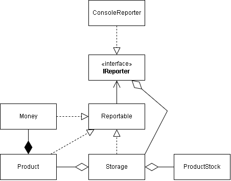

## Діаграма UML

## Використані принципи

### Fail Fast

В Product.DecreasePrice() та Storage.RemoveProductQuantity() є перевірки на помилки, що відразу кидають Exception, якщо ціна або кількість продукту виходять за допустимі межі.

### KISS (Keep It Simple, Stupid)

Класи мають чітку структуру, змінні мають зрозумілі назви (Price, QuantityUnit і т. д.).

### Liskov Substitution Principle (LSP) (SOLID)

ConsoleReporter реалізує IReporter і може використовуватися замість будь-якого іншого IReporter без зміни логіки програми.

### DRY (Don’t Repeat Yourself)

Використання Reportable зменшує дублювання коду для звітування.

Money, Product, ProductStock містять методи для отримання інформації, що запобігає дублікації коду в інших класах.

### Interface Segregation Principle (ISP) (SOLID)

IReporter містить лише один метод Print(), що запобігає навантаженню зайвими методами.

### Program to Interfaces, Not Implementations

Storage працює через IReporter, що дозволяє змінювати репортери без зміни основного коду.

### Dependency Inversion Principle (DIP) (SOLID)

Storage працює через інтерфейс IReporter, що дозволяє передавати різні реалізації репортерів.

### Single Responsibility Principle (SRP) (SOLID)

Кожен клас виконує лише одну відповідальність:

Money – управління грошима.

Product – управління товаром.

ProductStock – зберігання інформації про кількість товару.

Storage – управління складом.

ConsoleReporter – виведення звітів.

Reportable – базовий клас для об'єктів, що можуть бути у звітах.

